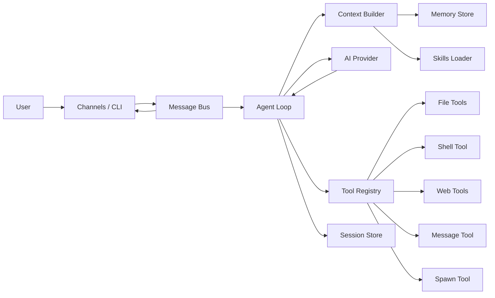
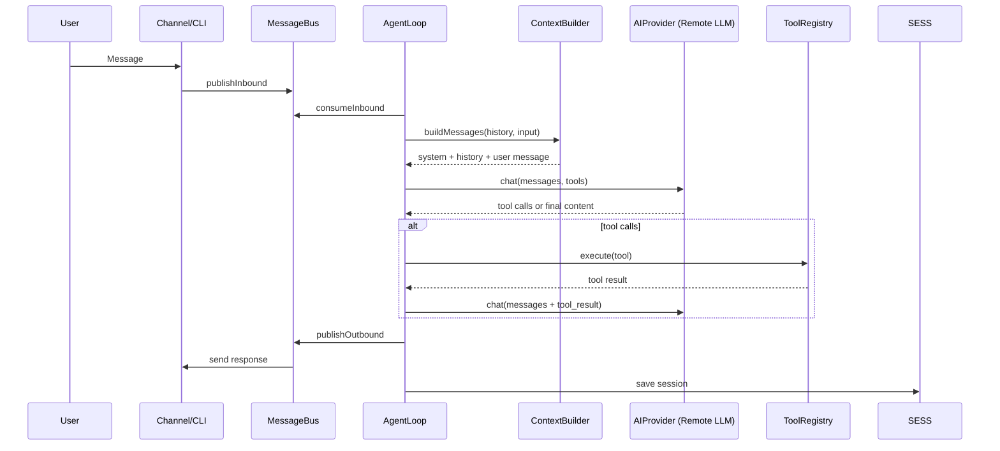
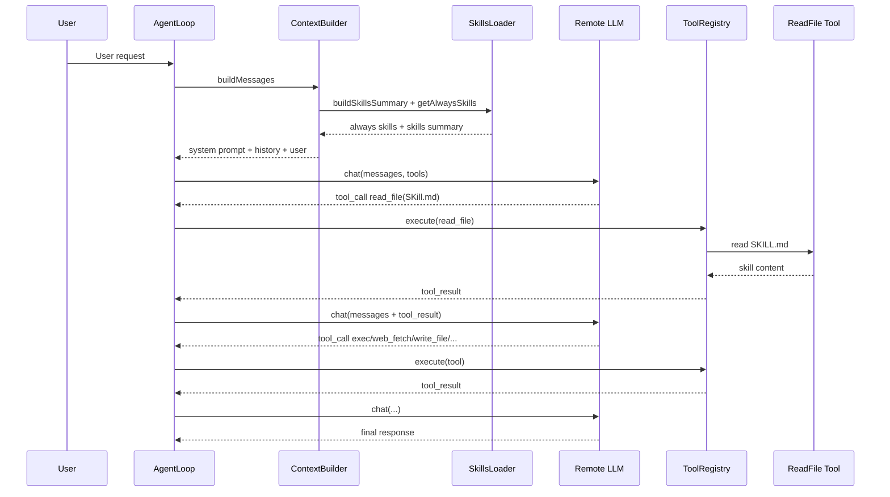
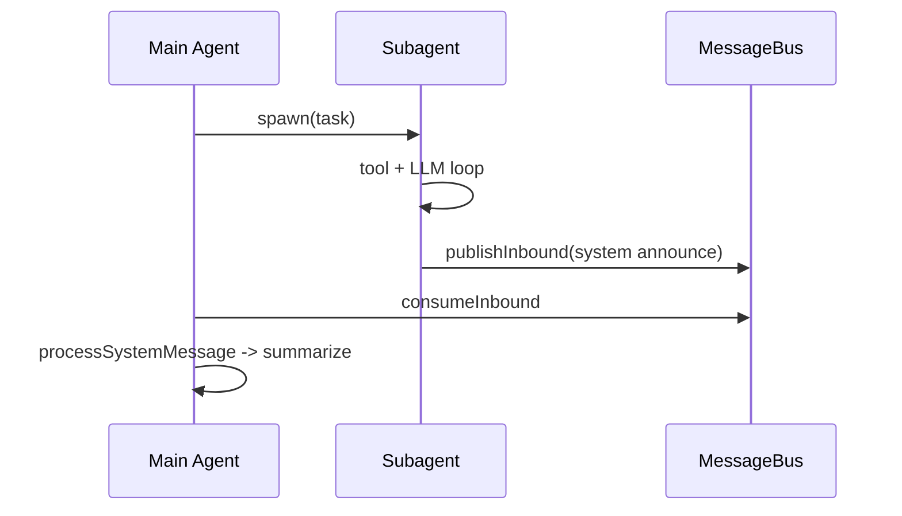
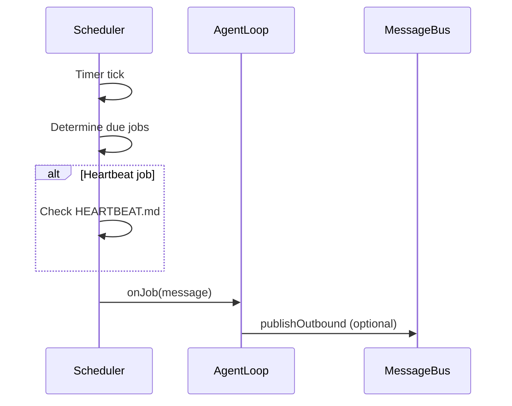

# miniclawd Architecture

This document describes the architecture of **miniclawd**, focusing on module boundaries, execution flow, and how local skills are orchestrated with remote AIGC models to complete complex tasks.

---

**Audience**
- Developers integrating or extending the system
- Engineers interested in runtime flow and tool orchestration

**Goals**
- Explain end-to-end runtime flow for user requests
- Detail the skill system design and invocation sequence
- Provide module-level breakdown with implementation anchors

---

**System Overview**

miniclawd is a lightweight AI assistant with multi-channel I/O, multi-provider LLM access, a local tool system, and a Markdown-based skill mechanism. It executes in a single process, using an in-memory message bus to decouple channels from the agent loop.

**Key Properties**
- Single-process runtime with async loops
- Remote LLM for reasoning and planning
- Local tools for side effects and environment interaction
- Skills are Markdown instructions used to guide LLM tool selection

---

**High-Level Architecture**

---

**Module Breakdown**

**1) CLI & Process Entry**
- Entry point: `D:\workspace\miniclawd\src\index.ts`
- Commands: `D:\workspace\miniclawd\src\cli\commands.ts`

Responsibilities:
- Bootstrapping config and workspace (`onboard`)
- Running agent directly (`agent`)
- Starting gateway (channels + scheduler + agent loop)
- Cron management (add, list, remove, run)

**2) Application Layer**
- Agent loop: `D:\workspace\miniclawd\src\application\agent-loop.ts`
- Context builder: `D:\workspace\miniclawd\src\application\context-builder.ts`
- Skills loader: `D:\workspace\miniclawd\src\application\skills-loader.ts`
- Subagent manager: `D:\workspace\miniclawd\src\application\subagent.ts`
- Scheduler: `D:\workspace\miniclawd\src\application\scheduler.ts`

Responsibilities:
- Orchestrating messages, LLM calls, tool execution
- Building prompt context (bootstrap files, memory, skills)
- Spawning subagents for background tasks
- Handling cron and heartbeat tasks

**3) Infrastructure Layer**
- LLM provider: `D:\workspace\miniclawd\src\infrastructure\llm\ai-sdk-provider.ts`
- Message bus: `D:\workspace\miniclawd\src\infrastructure\queue\message-bus.ts`
- Events: `D:\workspace\miniclawd\src\infrastructure\queue\events.ts`
- Channel manager: `D:\workspace\miniclawd\src\infrastructure\channels\manager.ts`
- Channel base: `D:\workspace\miniclawd\src\infrastructure\channels\base.ts`
- Config: `D:\workspace\miniclawd\src\infrastructure\config\loader.ts`
- Config schema: `D:\workspace\miniclawd\src\infrastructure\config\schema.ts`

Responsibilities:
- Wrapping multi-provider LLM access
- Decoupling inbound/outbound message flow
- Coordinating channel lifecycles
- Loading and validating configuration

**4) Tooling Layer**
- Tool base: `D:\workspace\miniclawd\src\tools\base.ts`
- Tool registry: `D:\workspace\miniclawd\src\tools\registry.ts`
- File tools: `D:\workspace\miniclawd\src\tools\fs.ts`
- Shell tool: `D:\workspace\miniclawd\src\tools\exec.ts`
- Web tools: `D:\workspace\miniclawd\src\tools\web.ts`
- Message tool: `D:\workspace\miniclawd\src\tools\message.ts`
- Spawn tool: `D:\workspace\miniclawd\src\tools\spawn.ts`

Responsibilities:
- Exposing local capabilities to the LLM
- Enforcing tool argument schemas
- Executing side-effecting operations

**5) Storage Layer**
- Session store: `D:\workspace\miniclawd\src\infrastructure\storage\session-store.ts`
- Memory store: `D:\workspace\miniclawd\src\infrastructure\storage\memory-store.ts`

Responsibilities:
- Persisting conversation sessions
- Managing long-term memory and daily notes

---

**Core Runtime Flow**

---

**Skill System Design**

Skills are Markdown-based instructions. They are not code plugins. Their role is to influence LLM planning and tool selection.

**Skill Locations**
- Workspace skills: `<workspace>/skills/{skill}/SKILL.md`
- Built-in skills: `D:\workspace\miniclawd\skills\{skill}\SKILL.md`

**Skill Loading Strategy**
1. Load workspace skills first.
2. Load built-in skills if no workspace override exists.
3. Read frontmatter and parse metadata.
4. Filter by requirements (bins/env).

**Skill Discovery in Prompt**
- Always-loaded skills are injected fully into the system prompt.
- All skills are listed in an XML-like summary block.
- LLM is instructed to `read_file` the skill’s `SKILL.md` when needed.

Relevant code:
- `D:\workspace\miniclawd\src\application\skills-loader.ts`
- `D:\workspace\miniclawd\src\application\context-builder.ts`

---

**Skill Invocation Sequence**

**Design Notes**
- Skills are declarative and do not run code.
- The LLM decides when to load skills and which tools to use.
- The ToolRegistry is the execution boundary for all side effects.

---

**Subagent Execution Flow**

Subagents are background workers used for long-running tasks. They have limited tool access and report results via a system message.

Relevant code:
- `D:\workspace\miniclawd\src\application\subagent.ts`
- `D:\workspace\miniclawd\src\tools\spawn.ts`

---

**Scheduler & Heartbeat**

Scheduler supports `cron`, `every`, and `at` job types. Heartbeat is a special recurring job that checks `HEARTBEAT.md` for actionable content.

Relevant code:
- `D:\workspace\miniclawd\src\application\scheduler.ts`

---

**Data Model Summary**

**InboundMessage / OutboundMessage**
- Location: `D:\workspace\miniclawd\src\core\types\message.ts`
- Used for all inter-module message passing

**Session**
- Location: `D:\workspace\miniclawd\src\core\types\session.ts`
- Stored in `~/.miniclawd/sessions/*.jsonl`

**ScheduledJob**
- Location: `D:\workspace\miniclawd\src\core\types\scheduler.ts`
- Stored in `~/.miniclawd/cron/jobs.json`

---

**Configuration & Extensibility**

Configuration schema:
- `D:\workspace\miniclawd\src\infrastructure\config\schema.ts`

Extensibility points:
- Add a new channel by extending `BaseChannel`
- Add a new tool by implementing `Tool` and registering it
- Add a new skill by dropping a `SKILL.md` into workspace skills
- Add a new LLM provider by extending `AIProvider`

---

**Operational Considerations**

**Reliability**
- The message bus is in-memory and not durable.
- Tool execution is best-effort, errors are returned to the LLM.

**Observability**
- Logging uses `logger` in critical paths.
- No centralized tracing or metrics present.

**Platform Notes**
- Skill dependency checks use `which`, which is Unix-oriented.
- On Windows, availability detection may need adjustment.

---

**Security & Trust Boundaries**

Trust boundaries:
- Remote LLM has no direct system access.
- All side effects go through local tools.

Risk areas:
- `exec` tool executes shell commands.
- `web_fetch` and `web_search` perform network access.
- Skills can instruct LLM to use any available tool.

Mitigation recommendations:
- Add allowlist policies for tool usage in production environments.
- Introduce per-tool permission gating.
- Restrict `exec` to safe commands or sandboxed contexts.

---

**Appendix: Key File Index**

**Core**
- `D:\workspace\miniclawd\src\application\agent-loop.ts`
- `D:\workspace\miniclawd\src\application\context-builder.ts`
- `D:\workspace\miniclawd\src\application\skills-loader.ts`
- `D:\workspace\miniclawd\src\infrastructure\llm\ai-sdk-provider.ts`

**Tools**
- `D:\workspace\miniclawd\src\tools\base.ts`
- `D:\workspace\miniclawd\src\tools\registry.ts`
- `D:\workspace\miniclawd\src\tools\fs.ts`
- `D:\workspace\miniclawd\src\tools\exec.ts`
- `D:\workspace\miniclawd\src\tools\web.ts`
- `D:\workspace\miniclawd\src\tools\spawn.ts`

**Channels & Bus**
- `D:\workspace\miniclawd\src\infrastructure\channels\manager.ts`
- `D:\workspace\miniclawd\src\infrastructure\queue\message-bus.ts`

**Storage**
- `D:\workspace\miniclawd\src\infrastructure\storage\session-store.ts`
- `D:\workspace\miniclawd\src\infrastructure\storage\memory-store.ts`

